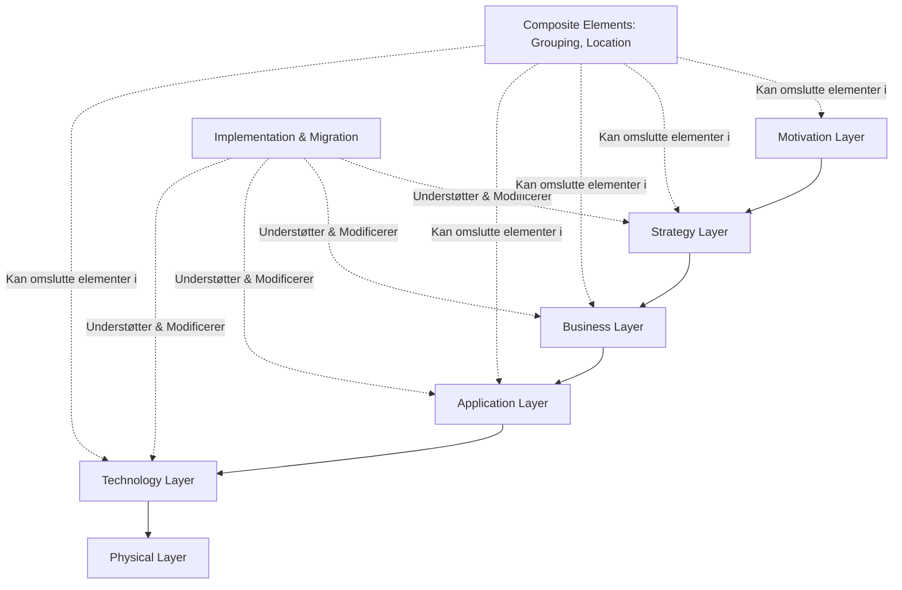
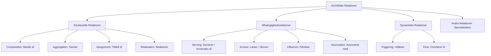

# ArchiMate 3.2 Ontologi & Metamodelspecifikation

Dette dokument præsenterer en fuldstændig ontologi for **ArchiMate 3.2**, baseret på den officielle specifikation og referencekortene i [.agent/wiki/raw/archimate_specification3-2.pdf](file:///home/rolfmadsen/Github/knowledgegraphstudio/.agent/wiki/raw/archimate_specification3-2.pdf). Ontologien fungerer som reference for semantisk modellering i TypeGraph.

---

## 1. Kernestruktur og Lag (Layers)

ArchiMate 3.2 er opdelt i en række semantiske lag, der spænder fra strategisk motivation til fysisk implementering:

---

## 2. Motivationselementer (Motivation Elements)

Motivationselementer anvendes til at modellere årsagerne til (hvorfor) en enterprise-arkitektur designes, ændres eller drives.

| Element | Engelsk Term | Definition |
| :--- | :--- | :--- |
| **Interessent** | *Stakeholder* | Repræsenterer rollen for en person, et team eller en organisation, der har interesser i arkitekturens effekter. |
| **Drivkraft** | *Driver* | Repræsenterer en ekstern eller intern omstændighed, der motiverer en organisation til at definere sine mål og iværksætte forandringer. |
| **Vurdering** | *Assessment* | Repræsenterer resultatet af en analyse af en situation (fx styrker, svagheder, muligheder, trusler) i forhold til en drivkraft. |
| **Mål** | *Goal* | Repræsenterer en overordnet hensigtserklæring, retning eller ønsket sluttilstand for en organisation og dens interessenter. |
| **Resultat** | *Outcome* | Repræsenterer et konkret slutresultat, en effekt eller en konsekvens af en bestemt tilstand. |
| **Princip** | *Principle* | Repræsenterer en hensigtserklæring, der definerer en generel egenskab eller regel, der gælder for ethvert system i en bestemt kontekst. |
| **Krav** | *Requirement* | Repræsenterer en erklæring om behov, der definerer en specifik egenskab, som skal opfyldes af et system. |
| **Begrænsning** | *Constraint* | Repræsenterer en restriktion på aspekter af arkitekturen, dens implementeringsproces eller dens realisering. |
| **Betydning** | *Meaning* | Repræsenterer den viden, ekspertise eller fortolkning, der gives til et koncept i en bestemt kontekst. |
| **Værdi** | *Value* | Repræsenterer den relative nytte, vigtighed eller økonomiske/ikke-økonomiske værdi af et koncept. |

---

## 3. Strategilag (Strategy Layer)

Strategilaget forbinder motivationen med forretningsdriften ved at modellere organisationens strategiske evner og langsigtede planer.

| Element | Engelsk Term | Definition |
| :--- | :--- | :--- |
| **Ressource** | *Resource* | Repræsenterer et aktiv (fysisk, finansielt, informationelt eller humant), som ejes eller kontrolleres af en organisation. |
| **Evne** | *Capability* | Repræsenterer en færdighed eller kapacitet, som en aktiv struktur (fx organisation, person eller system) besidder. |
| **Værdistrøm** | *Value Stream* | Repræsenterer en sekvens af aktiviteter, der skaber et samlet værdifuldt resultat for en kunde, interessent eller slutbruger. |
| **Strategisk Kurs** | *Course of Action* | Repræsenterer en tilgang eller plan for at konfigurere evner og ressourcer med henblik på at opnå et mål. |

---

## 4. Forretningslag (Business Layer)

Forretningslaget modellerer de operationelle strukturer, processer, roller og services, som organisationen tilbyder sine kunder.

| Element | Engelsk Term | Definition |
| :--- | :--- | :--- |
| **Forretningsaktør** | *Business Actor* | Repræsenterer en forretningsenhed (fx person, afdeling, virksomhed), der er i stand til at udføre adfærd. |
| **Forretningsrolle** | *Business Role* | Repræsenterer ansvaret for at udføre bestemt adfærd, som en aktør kan tildeles, eller den rolle en aktør spiller. |
| **Forretningssamarbejde** | *Business Collaboration* | Repræsenterer et aggregat af to eller flere interne aktive struktur-elementer (aktører/roller), der arbejder sammen. |
| **Forretningsgrænseflade** | *Business Interface* | Repræsenterer et adgangspunkt (fx en portal, skranke eller API), hvor en forretningsservice gøres tilgængelig. |
| **Forretningsproces** | *Business Process* | Repræsenterer en sekvens af forretningsaktiviteter, der opnår et specifikt resultat (fx produktion af et produkt). |
| **Forretningsfunktion** | *Business Function* | Repræsenterer en samling af adfærd baseret på bestemte kriterier (fx kompetencer), tæt knyttet til en organisation. |
| **Forretningsinteraktion** | *Business Interaction* | Repræsenterer en enhed af kollektiv adfærd udført af et samarbejde mellem flere aktører eller roller. |
| **Forretningshændelse** | *Business Event* | Repræsenterer en forretningsrelateret tilstandsændring (fx modtagelse af en ordre), der kan trigge adfærd. |
| **Forretningsservice** | *Business Service* | Repræsenterer eksplicit defineret adfærd, som en rolle, aktør eller samarbejde udstiller til sine omgivelser. |
| **Forretningsobjekt** | *Business Object* | Repræsenterer et passivt begreb eller informationselement (fx en kontrakt eller faktura), der anvendes i forretningen. |
| **Kontrakt** | *Contract* | Repræsenterer en formel eller uformel aftale mellem en udbyder og en forbruger, der definerer rettigheder og pligter. |
| **Repræsentation** | *Representation* | Repræsenterer den sansbare form (fx et dokument, et skærmbillede eller lyd), hvormed information formidles. |
| **Produkt** | *Product* | Repræsenterer en sammenhængende samling af services, ledsaget af en kontrakt, der tilbydes kunder som en helhed. |

---

## 5. Applikationslag (Application Layer)

Applikationslaget modellerer softwareapplikationer, deres komponenter, adfærd og de data, de behandler.

| Element | Engelsk Term | Definition |
| :--- | :--- | :--- |
| **Applikationskomponent** | *Application Component* | Repræsenterer en indkapsling af applikationsfunktionalitet, der er modulær og udskiftelig (fx et CRM-system). |
| **Applikationssamarbejde** | *Application Collaboration* | Repræsenterer et samarbejde mellem to eller flere applikationskomponenter for at udføre fælles adfærd. |
| **Applikationsgrænseflade** | *Application Interface* | Repræsenterer et teknisk adgangspunkt (fx et REST API), hvor applikationsservices gøres tilgængelige. |
| **Applikationsfunktion** | *Application Function* | Repræsenterer automatiseret adfærd, som kan udføres af en applikationskomponent. |
| **Applikationsinteraktion** | *Application Interaction* | Repræsenterer kollektiv adfærd udført af et samarbejde mellem applikationskomponenter. |
| **Applikationsproces** | *Application Process* | Repræsenterer en sekvens af applikationsaktiviteter, der opnår et specifikt resultat. |
| **Applikationshændelse** | *Application Event* | Repræsenterer en applikationsrelateret tilstandsændring (fx en systemfejl eller modtaget besked). |
| **Applikationsservice** | *Application Service* | Repræsenterer en eksponeret adfærd, som en applikationskomponent eller grænseflade tilbyder til andre. |
| **Dataobjekt** | *Data Object* | Repræsenterer data struktureret til automatiseret behandling (fx en databasepost eller en JSON-payload). |

---

## 6. Teknologi- og Fysisk Lag (Technology & Physical Layer)

Teknologilaget modellerer den underliggende infrastruktur (hardware, systemsoftware og netværk), mens det fysiske lag modellerer materielle aktiver.

### Teknologi-infrastruktur
| Element | Engelsk Term | Definition |
| :--- | :--- | :--- |
| **Knude** | *Node* | Repræsenterer en beregningsmæssig eller fysisk ressource, der hoster eller interagerer med andre ressourcer. |
| **Enhed** | *Device* | Repræsenterer en fysisk it-ressource (fx en server, pc eller smartphone), hvorpå software kan lagres og eksekveres. |
| **Systemsoftware** | *System Software* | Repræsenterer software (fx et operativsystem, en database-engine eller en applikationsserver), der kører på en enhed. |
| **Teknologisamarbejde** | *Technology Collaboration* | Repræsenterer et samarbejde mellem to eller flere it-ressourcer (fx en cluster af servere). |
| **Teknologigrænseflade** | *Technology Interface* | Repræsenterer et adgangspunkt (fx en netværksport eller middleware-grænseflade), hvor services udstilles. |
| **Sti** | *Path* | Repræsenterer en forbindelse mellem to eller flere knuder, hvorigennem data, energi eller materiale kan udveksles. |
| **Kommunikationsnetværk** | *Communication Network* | Repræsenterer infrastrukturen til transmission, routing og modtagelse af data (fx et LAN eller WAN). |
| **Teknologifunktion** | *Technology Function* | Repræsenterer en samling af adfærd, der udføres af et teknologielement (fx backup-tjeneste). |
| **Teknologiproces** | *Technology Process* | Repræsenterer en sekvens af teknologiske aktiviteter (fx en udrulningsproces eller boot-sekvens). |
| **Teknologiinteraktion** | *Technology Interaction* | Repræsenterer kollektiv adfærd udført af et samarbejde mellem it-infrastrukturelementer. |
| **Teknologihændelse** | *Technology Event* | Repræsenterer en infrastrukturrelateret tilstandsændring (fx en diskfejl eller CPU-spidsbelastning). |
| **Teknologiservice** | *Technology Service* | Repræsenterer en infrastrukturadfærd (fx lagring, routing), som udstilles gennem en teknologigrænseflade. |
| **Artefakt** | *Artifact* | Repræsenterer et stykke data, der produceres i en softwareproces eller ved udrulning (fx en `.jar` fil eller SQL script). |

### Fysiske Elementer (Physical Layer)
| Element | Engelsk Term | Definition |
| :--- | :--- | :--- |
| **Udstyr** | *Equipment* | Repræsenterer fysiske maskiner, værktøjer eller instrumenter, der kan flytte, transformere eller opbevare materialer. |
| **Facilitet** | *Facility* | Repræsenterer en fysisk struktur eller et fysisk miljø (fx en fabrik, et datacenter eller et kontor). |
| **Distributionsnetværk** | *Distribution Network* | Repræsenterer det fysiske netværk, der transporterer materialer eller energi (fx et elnet eller rørledning). |
| **Materiale** | *Material* | Repræsenterer håndgribeligt fysisk stof eller råvarer (fx papir, træ, jern, olie). |

---

## 7. Implementerings- og Migrationslag (Implementation & Migration Layer)

Dette lag bruges til at planlægge, styre og modellere overgangen fra én arkitektur-tilstand (nuværende) til en anden (fremtidig).

| Element | Engelsk Term | Definition |
| :--- | :--- | :--- |
| **Arbejdspakke** | *Work Package* | Repræsenterer en serie af handlinger (fx et projekt eller program), der skal opnå et bestemt resultat inden for rammer. |
| **Leverance** | *Deliverable* | Repræsenterer et præcist defineret slutresultat af en arbejdspakke (fx et nyt system eller en rapport). |
| **Implementeringshændelse** | *Implementation Event* | Repræsenterer en tilstandsændring relateret til overgangen (fx go-live eller projektafslutning). |
| **Plateau** | *Plateau* | Repræsenterer en relativt stabil tilstand af enterprise-arkitekturen i en tidsbegrænset periode (fx Fase 1-tilstand). |
| **Gab** | *Gap* | Repræsenterer en konstateret forskel mellem to plateauer (hvad mangler for at nå næste tilstand). |

---

## 8. Sammensatte og Andre Elementer (Composite & Other Elements)

Elementer, der ikke er låst til ét enkelt lag, men kan spænde over eller samle elementer på tværs af lag.

| Element | Engelsk Term | Definition |
| :--- | :--- | :--- |
| **Gruppering** | *Grouping* | Aggregerer eller sammensætter koncepter, der hører sammen baseret på en fælles egenskab eller kontekst. |
| **Lokation** | *Location* | Repræsenterer et konceptuelt eller fysisk sted, hvor adfærd udføres, eller aktive strukturer er placeret. |
| **Forgrening** | *Junction* | Anvendes til at forbinde og splitte adfærdsrelationer (fx AND-Junction, OR-Junction). |

---

## 9. Relationer (Relationships)

Relationerne i ArchiMate 3.2 definerer de semantiske og strukturelle forbindelser mellem elementerne. De er opdelt i fire hovedkategorier:

### Strukturelle Relationer (Structural)
Strukturelle relationer beskriver statiske, hierarkiske eller tildelte forbindelser mellem elementer.

*   **Sammensætning (*Composition*)**
    *   **Beskrivelse**: Angiver, at et element består af et eller flere andre elementer. Delene kan ikke eksistere uafhængigt af helheden.
    *   **Notation**: Linje med udfyldt diamant ($\blacklozenge\!\!-\!\!-$) ved kilden.
*   **Aggregering (*Aggregation*)**
    *   **Beskrivelse**: Angiver, at et element samler et eller flere andre elementer. Delene kan godt eksistere uafhængigt af helheden.
    *   **Notation**: Linje med åben diamant ($\diamondsuit\!\!-\!\!-$) ved kilden.
*   **Tildeling (*Assignment*)**
    *   **Beskrivelse**: Repræsenterer tildeling af ansvar, adfærd eller eksekveringsmiljø til en aktiv struktur (fx en rolle tildelt en proces).
    *   **Notation**: Linje med en udfyldt cirkel i startpunktet og pil i endepunktet ($\bullet\!\!-\!\!\rightarrow$).
*   **Realisering (*Realization*)**
    *   **Beskrivelse**: Angiver, at et mere konkret element spiller en kritisk rolle i skabelsen, opnåelsen eller driften af et mere abstrakt element (fx en applikationsfunktion realiserer en service).
    *   **Notation**: Stiplede linje med åbent pilehoved ($-\!-\!-\!\blacktriangleright$).

### Afhængighedsrelationer (Dependency)
Afhængighedsrelationer beskriver, hvordan elementer understøtter, påvirker eller tilgår hinanden.

*   **Betjening (*Serving*)**
    *   **Beskrivelse**: Angiver, at et element stiller sin funktionalitet til rådighed for et andet element (fx en applikationsservice betjener en forretningsproces).
    *   **Notation**: Solid linje med pil ($-\!\rightarrow$).
*   **Adgang (*Access*)**
    *   **Beskrivelse**: Repræsenterer evnen for et aktivt element til at observere, læse, oprette eller skrive til et passivt element (fx proces tilgår et dataobjekt). Kan være retningsbestemt (Read, Write, Read/Write).
    *   **Notation**: Stiplede linje med pil ($-\!-\!\rightarrow$, $\leftarrow\!-\!-$, eller dobbeltsidet $\leftarrow\!-\!-\rightarrow$).
*   **Påvirkning (*Influence*)**
    *   **Beskrivelse**: Angiver, at et element påvirker opnåelsen af et motivationselement (fx et krav påvirker et mål positivt eller negativt). Kan annoteres med $+$ eller $-$.
    *   **Notation**: Stiplede linje med åben pil og optionalt $+/-$ tegn ($-\!-\!\!\stackrel{+/-}{\longrightarrow}$).
*   **Associering (*Association*)**
    *   **Beskrivelse**: Repræsenterer en uspecificeret semantisk relation mellem to elementer, der ikke kan dækkes af andre relationer.
    *   **Notation**: Simpel solid linje uten pilehoved ($-\!\!-$).

### Dynamiske Relationer (Dynamic)
Dynamiske relationer modellerer tidsmæssige eller kausale forløb samt overførsler.

*   **Udløsning (*Triggering*)**
    *   **Beskrivelse**: Repræsenterer en tidsmæssig eller kausal rækkefølge mellem adfærdselementer (fx Proces A udløser Proces B).
    *   **Notation**: Solid linje med fyldt pil ($-\!\!\rightarrow$).
*   **Strøm (*Flow*)**
    *   **Beskrivelse**: Repræsenterer overførsel af information, værdi, energi eller materiale fra et element til et andet.
    *   **Notation**: Stiplede linje med fyldt pil ($-\!-\!\rightarrow$).

### Andre Relationer
*   **Specialisering (*Specialization*)**
    *   **Beskrivelse**: Angiver, at et element er en specifik variant af et andet mere generelt element (arv).
    *   **Notation**: Solid linje med åbent trekantet pilehoved ($-\!\!\blacktriangleright$).

---

## 10. Tilladte Relationsregler (Derivation & Rules)

Ifølge ArchiMate-specifikationen må relationer ikke oprettes vilkårligt på tværs af lag. Hovedprincipperne for gyldige forbindelser er styret af **Derivationsreglen**:

1.  **Strukturel Overførsel**: Hvis element $A$ har en sammensætnings-/aggregeringsrelation til element $B$, og $B$ har en relation til $C$, kan relationen afledes direkte fra $A$ til $C$.
2.  **Lag-forbindelser**:
    *   **Teknologilag** realiserer **Applikationslag**.
    *   **Applikationslag** realiserer **Forretningslag** (eller understøtter det via *Serving*).
    *   **Strategi** guider **Forretningslag**.
    *   **Motivation** påvirker **Strategi** og **Forretning**.
3.  **Adfærd og Aktiv Struktur**:
    *   Aktive strukturelementer (aktører, roller, komponenter) tildeles (*Assignment*) til adfærdselementer (processer, funktioner, interaktioner).
    *   Adfærdselementer realiserer (*Realization*) services.
    *   Services betjener (*Serving*) andre adfærdselementer eller aktive strukturer.
    *   Adfærdselementer tilgår (*Access*) passive strukturelementer (dataobjekter, forretningsobjekter).

*For yderligere præcise regler og valideringsadfærd i TypeGraph, se systemets matrixfil på: [matrix.json](file:///home/rolfmadsen/Github/knowledgegraphstudio/src/plugins/archimate/matrix.json).*
