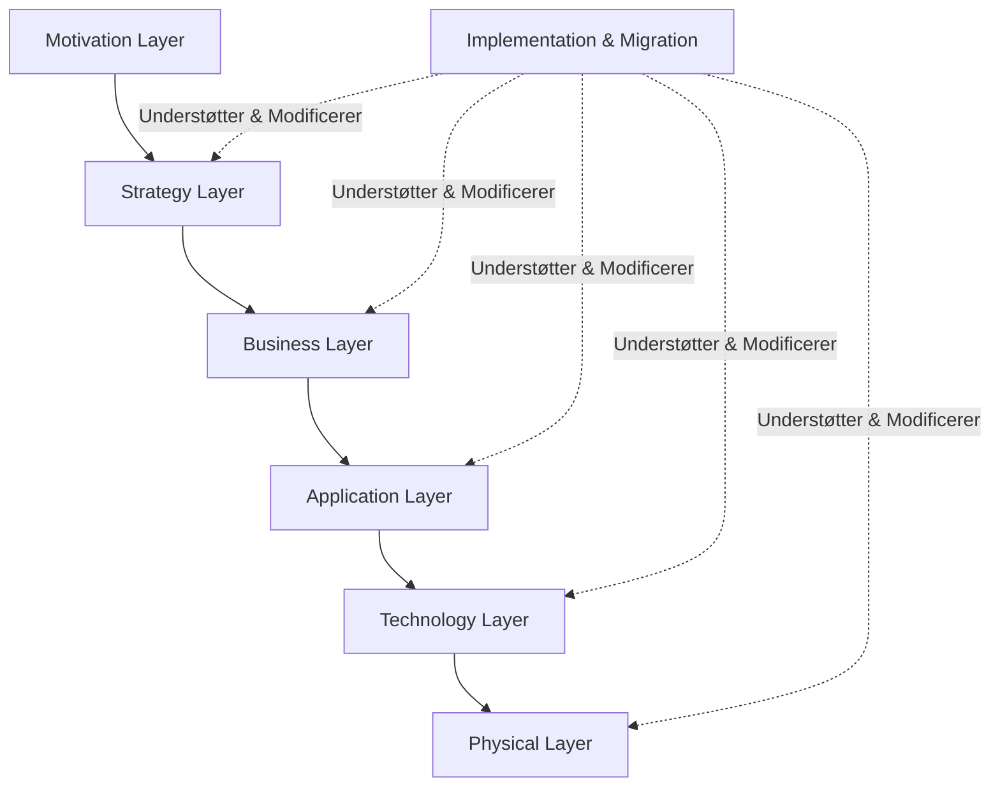

# ArchiMate 3.2 Ontologi & Metamodelspecifikation

Dette dokument præsenterer en fuldstændig ontologi for **ArchiMate 3.2**, baseret på den officielle specifikation og referencekortene i [wiki/raw/archimate_specification3-2.pdf](file:///home/rolfmadsen/Github/knowledgegraphstudio/wiki/raw/archimate_specification3-2.pdf). Ontologien fungerer som reference for semantisk modellering i xArchi.

---

## 1. Kernestruktur og Lag (Layers)

ArchiMate 3.2 er opdelt i en række semantiske lag, der spænder fra strategisk motivation til fysisk implementering:

---

## 2. Elementklassifikation

Følgende tabel viser de specifikke elementer, der understøttes i hvert lag, samt deres mapping til interne systemtyper (`ConceptType`):

### 🎯 Strategy Layer
*   **`resource`** («Resource»): En evne eller et aktiv (fx data, finansielle midler, udstyr).
*   **`capability`** («Capability»): En forretningsevne (fx "Sagsbehandling" eller "Kreditvurdering").
*   **`value_stream`** («Value Stream»): En værdikæde af aktiviteter, der skaber værdi.
*   **`course_of_action`** («Course of Action»): En strategisk retning eller plan.

### 💼 Business Layer
*   **`actor`** («Business Actor»): En organisatorisk enhed, person eller autoritet (fx "Kunde" eller "Sagsbehandler").
*   **`business_role`** («Business Role»): Ansvar eller kompetenceområde (fx "Låneansvarlig").
*   **`business_interface`** («Business Interface»): Adgangspunkt, hvor en tjeneste tilbydes (fx "Kundeservice-hotline").
*   **`business_collaboration`** («Business Collaboration»): Samarbejde mellem roller/aktører uden formel struktur.
*   **`business_process`** (mappes til **`process`**): En sekvens af forretningsaktiviteter.
*   **`business_function`** («Business Function»): Interne kompetencer (fx "Regnskabsføring").
*   **`business_interaction`** («Business Interaction»): Samarbejdsadfærd mellem flere forretningsenheder.
*   **`business_event`** (mappes til **`event`**): En hændelse, der trigger adfærd.
*   **`business_service`** («Business Service»): Eksponeret forretningsværdi (fx "Udbetaling af lån").
*   **`business_object`** («Business Object»): Informationsobjekt (fx "Låneansøgning").
*   **`contract`** («Contract»): Formelle aftaler og vilkår.
*   **`representation`** («Representation»): Præsentation af information (fx "PDF-Faktura").
*   **`product`** («Product»): En samling af ydelser, kontrakter og objekter.

### 💻 Application Layer
*   **`application_component`** («Application Component»): Softwareenhed (fx "Zustand Core Engine" eller "Nyt SIS").
*   **`application_collaboration`** («Application Collaboration»): Samarbejde mellem softwareenheder.
*   **`application_interface`** («Application Interface»): API eller UI-adgangspunkt (fx "GraphQL API").
*   **`application_function`** («Application Function»): Intern softwarefunktionalitet (fx "PDF-Generering").
*   **`application_interaction`** («Application Interaction»): Samarbejde mellem applikationsfunktioner.
*   **`application_process`** («Application Process»): Intern applikationsarbejdsgang.
*   **`application_event`** («Application Event»): Systemhændelse (fx "JobQueue_Failed").
*   **`application_service`** («Application Service»): Eksponeret softwarefunktionalitet (fx "Autentificeringstjeneste").
*   **`data_object`** (mappes til **`entity`**): Logisk dataelement (fx "Database Record").

### ⚙️ Technology & Physical Layer
*   **`node`** («Node»): Beregningsmiljø (fx "Kubernetes Cluster").
*   **`device`** («Device»): Fysisk hardware (fx "iPad").
*   **`system_software`** («System Software»): OS eller runtime (fx "Node.js v22").
*   **`technology_interface`** («Technology Interface»): Netværks-adgangspunkt.
*   **`technology_collaboration`** («Technology Collaboration»): Samarbejde i tech-laget.
*   **`technology_function`** («Technology Function»): Infrastruktur-funktion (fx "Auto-scaling").
*   **`technology_process`** («Technology Process»): Systemarbejdsgang (fx "Backup script").
*   **`technology_interaction`** («Technology Interaction»): Samarbejde i tech-laget.
*   **`technology_event`** («Technology Event»): Hardware/netværkshændelse.
*   **`technology_service`** («Technology Service»): Infrastrukturtjeneste (fx "DNS Routing").
*   **`communication_network`** («Communication Network»): Netværk.
*   **`path`** («Path»): Forbindelse.
*   **`artifact`** («Artifact»): Fysisk softwarefil (fx "index.js").
*   **`equipment`** («Equipment»): Fysisk udstyr (fx "Kamera").
*   **`facility`** («Facility»): Fysisk bygning (fx "Datacenter i Taastrup").
*   **`distribution_network`** («Distribution Network»): Fysisk logistik.
*   **`material`** («Material»): Fysisk råstof (fx "Papir").

### 📈 Motivation Layer
*   **`stakeholder`** («Stakeholder»): Person/rolle med interesser.
*   **`driver`** («Driver»): Interne/eksterne påvirkninger (fx "GDPR Compliance").
*   **`assessment`** («Assessment»): Analyse (fx SWOT).
*   **`goal`** («Goal»): Hvad man ønsker at opnå.
*   **`outcome`** («Outcome»): Realiseret resultat.
*   **`principle`** («Principle»): Generelle retningslinjer (fx "Cloud First").
*   **`requirement`** («Requirement»): Specifikt krav.
*   **`constraint`** («Constraint»): Begrænsning.
*   **`value`** («Value»): Værdi.
*   **`meaning`** («Meaning»): Betydning.

### 🏗 Implementation & Migration Layer
*   **`work_package`** («Work Package»): Projekt/Sprint (fx "Fase 1: VFS Opsætning").
*   **`deliverable`** («Deliverable»): Leverance.
*   **`plateau`** («Plateau»): Baseline/Målarkitektur (fx "MVP 1.0").
*   **`gap`** («Gap»): Forskel mellem plateauer.
*   **`implementation_event`** (mappes til **`event`**): Projektrelateret hændelse.

---

## 3. Relationstyper og Regler

ArchiMate-relationer er strenge og opdelt i fire kategorier. De tillades kun mellem specifikke typer i `validator.ts`:

### Structural Relationships (Strukturelle relationer)
*   **`composition`** (Sammensætning - solid linje med fyldt ruder): "Består af". Det stærkeste ejerforhold.
*   **`aggregation`** (Aggregering - solid linje med tom ruder): "Indeholder". Svagere end composition.
*   **`assignment`** (Tildeling - solid linje med fyldt cirkel ved kilde): Kobler adfærd til en aktør/rolle.
*   **`realization`** (Realisering - stiplet linje med lukket pil): "Implementerer". Fx at en applikation realiserer en service.

### Dependency Relationships (Afhængigheder)
*   **`serving`** (Betjener - solid linje med åben pil): Gør noget tilgængeligt for andre.
*   **`access`** (Tilgår - stiplet linje med pil, der angiver Read/Write): Læser eller skriver data.
*   **`influence`** (Påvirker - stiplet linje med åben pil): Motivationel påvirkning.
*   **`association`** (Associering - simpel solid linje): Uspecificeret forbindelse.

### Dynamic Relationships (Dynamiske relationer)
*   **`triggering`** (Triggere - solid linje med lukket pil): Tidsmæssigt flow eller årsagssammenhæng.
*   **`flow`** (Dataflow - stiplet linje med lukket pil): Overførsel af information.

### Other Relationships (Andre relationer)
*   **`specialization`** (Specialisering - solid linje med åben trekantpil): Nedarvning / "Er en".

---

## 4. Visuelle Notationstegn (Styling)

Relationer (edges) i ArchiMate-pluginet farves og styles i `ReactFlow` i overensstemmelse med typen:
- **Assignment**: Grå tyk linje med cirkel-snapping.
- **Composition / Aggregation**: Sorte linjer med ruder-markers.
- **Realization**: Grønne stiplede linjer med hule pilehoveder.
- **Serving**: Blå linjer med åbne pilehoveder.
- **Triggering**: Røde linjer med fyldte pilehoveder.
