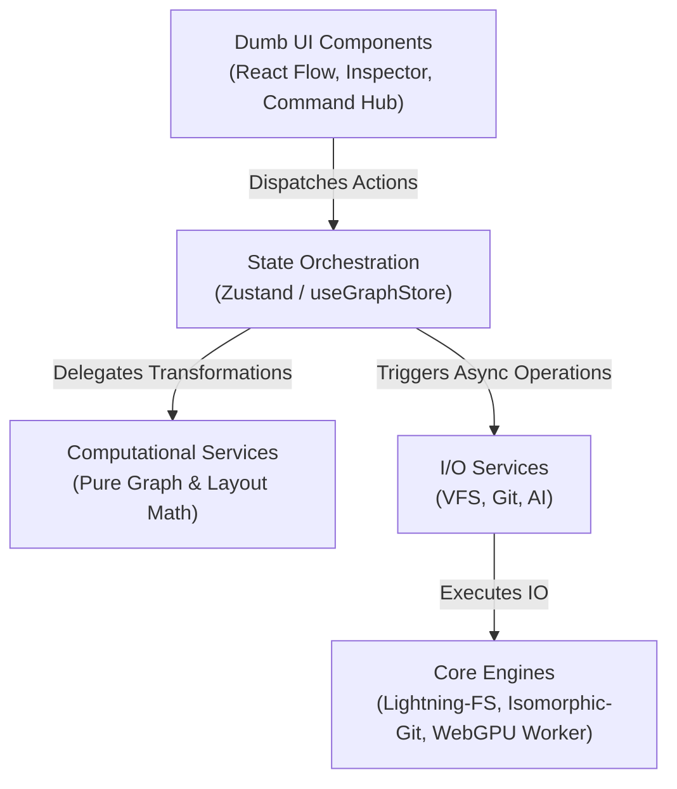

# System Architecture & Component Blueprint

Dette dokument giver et overblik over den overordnede systemarkitektur for xArchi (Knowledge Graph Studio), kildekodens modulære lagdeling og henviser til de autoritative arkitekturbeslutninger (ADR'er).

---

## 🎯 Oversigt over xArchi

xArchi er et lokalt ("local-first") og tastaturbaseret ("keyboard-first") modelleringsmiljø til semantiske vidensgrafer (Knowledge Graphs), begrebsmodeller og virksomhedsarkitektur. Applikationen afvikles i browseren og gemmer data i et virtuelt filsystem (VFS) understøttet af Git.

---

## 📐 Modulær Struktur (Feature-Sliced Design)

Kildekoden er organiseret efter Feature-Sliced Design (FSD) principper under `src/` for at sikre klar adskillelse af ansvarsområder:

* **`src/schema/`**: Datavalidering og schemas (primært Zod schemas i `graphSchema.ts`).
* **`src/core/`**: Lavniveaus motorer og infrastruktur (`fileSystem.ts`, `gitEngine.ts`, `yamlParser.ts`).
* **`src/store/`**: Central tilstandsbeholder via Zustand (`useGraphStore.ts`).
* **`src/services/`**: Forretningslag med skarpt opdelte Computational Services og I/O Services.
* **`src/features/`**: Domænespecifikke slices (`viewport/` med graf/kode, `properties/` med detaljevisning, `commands/` med Command Hub, `ai/` med model-worker).
* **`src/components/ui/`**: Fælles præsentationskomponenter og styling-primitiver.

> 🏛️ *For de formelle regler om lagdeling og tilladte afhængigheder, se [ADR 0009: Feature-Sliced Design Package Structure](./adr/0009-feature-sliced-design-package-structure.md).*

---

## 🏛️ Gældende Arkitekturbeslutninger (ADR Indeks)

Følgende Architecture Decision Records er gældende for systemets implementation og skal overholdes:

| ADR | Titel & Nøgleprincip |
| :--- | :--- |
| **[ADR 0001](./adr/0001-contract-first-service-pattern.md)** | **Contract-First Service Pattern**: Skarp opdeling mellem Computational Services (rene synkrone funktioner) og I/O Services (asynkrone sideeffekter). |
| **[ADR 0002](./adr/0002-typescript-module-syntax-and-strict-types.md)** | **Strict TypeScript & Type-Only Imports**: Eksplicit type-sikkerhed uden `as any` og isolerede moduler. |
| **[ADR 0003](./adr/0003-state-history-exclusion-zundo.md)** | **State History Exclusion**: Zundo undo/redo-historik med eksklusion af flygtig UI-tilstand (zoom, pan, selection). |
| **[ADR 0004](./adr/0004-datamodel-schema-constraints.md)** | **Datamodel Schema Constraints**: Zod-baseret schema runtime-validering for semantiske noder og kanter. |
| **[ADR 0005](./adr/0005-secure-credentials-handling.md)** | **Secure Credentials Handling**: Sikker opbevaring af git- og AI-nøgler i browser-session uden log-lækager. |
| **[ADR 0008](./adr/0008-canvas-geometry-grid-aligned-bounds.md)** | **Canvas Geometry Contract**: Grid-justerede initial bounds med grid-steppede ($24\text{px}$) DOM-målte højder og side-centrerede handles. |
| **[ADR 0009](./adr/0009-feature-sliced-design-package-structure.md)** | **Feature-Sliced Design Layout**: Modul- og pakkestruktur der forhindrer cirkulære afhængigheder. |
| **[ADR 0010](./adr/0010-in-browser-webgpu-ai-worker-and-memory-lifecycle.md)** | **In-Browser WebGPU AI Worker**: Lokal LLM-inferens i isoleret Web Worker med 5-minutters inaktivitet og 15-sekunders grace-timer for GPU-RAM frigivelse. |

---

## 🎨 Notationsspecifikationer & Domænemodeller

For dybdegående dokumentation og ontologier for de enkelte visningsprofiler:
* **[Notationsindeks & Metamodeller](./architecture-notations/README.md)**: Oversigt over ArchiMate 3.2, C4, DCR Graphs, Event Modeling, Begrebsmodel og Informationsmodel.
* **[Semantisk Mapping Matrix](./architecture-notations/mapping-matrix.md)**: Komplet mapping mellem `ConceptType` og stereotyper.
* **[UI & Tastaturnavigation](./architecture-notations/ui-and-shortcuts.md)**: Guide til de fire zoner og spatial walking.

---

## 🧪 Verifikation & Kvalitetssikring

Systemet overholder projektets Evidence-First gauntlet-standard:
* **Unit & Contract Tests**: `npm run test`
* **Type-sikkerhed**: `npx tsc --noEmit`
* **Gauntlet Verifikation**: `npx @agent-gauntlet/cli verify`
