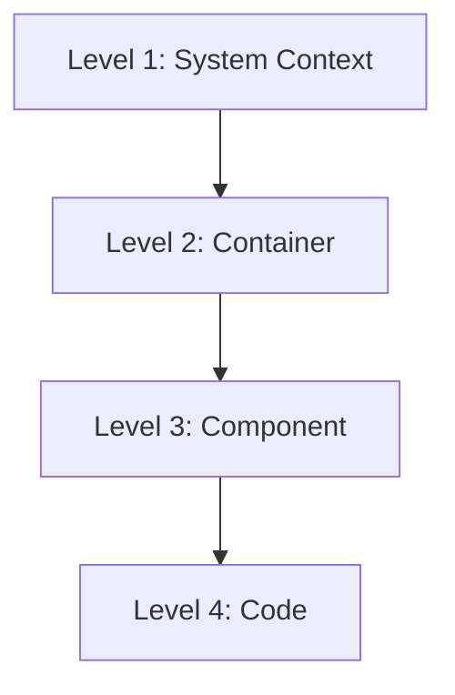

# C4 Model Ontologi & Metamodelspecifikation

Dette dokument beskriver kernestrukturen og elementerne for **C4 Model** notationen i Knowledge Graph Studio.

## 1. Kernestruktur og Lag

C4-modellen er opdelt i fire hierarkiske niveauer af software-abstraktioner:

---

## 2. Elementklassifikation

C4 model plugin'et understøtter følgende nodetyper og mapninger til `ConceptType`:

### 👤 Aktører
*   **`actor`** («Person»): En intern bruger af softwaren.
*   **`external_actor`** (mappes til **`actor`**): En ekstern bruger eller rolle.

### ⚙️ Software Elementer
*   **`system`** («Software System»): Det overordnede software-system, der modelleres.
*   **`external_system`** (mappes til **`system`**): Eksternt system uden for vores kontrol (fx "NemID" eller "Betalings-Gateway").
*   **`application_component`** (mappes til **`application_component`** / **«Container»**): En selvstændig kørbar enhed, server, webapp eller database (fx "Zustand Core Store" eller "IndexedDB VFS").
*   **`process`** (mappes til **`process`** / **«Component»**): En funktionel byggeklods eller modul inde i en container (fx "yamlParser" eller "gitEngine").

### 📦 Indkapsling (Boundaries)
*   **`bounded_context`** («Boundary» / «Container Boundary»): Grupperer logisk relaterede containers eller komponenter.

---

## 3. Relationstyper

C4-modellen anvender enkle og intuitive relationstyper:

*   **`uses`** (Bruger): En aktør eller et system interagerer med et andet element (fx "Sagsbehandler bruger Nyt SIS").
*   **`contains`** (Indlejrer): En container eller komponent befinder sig inde i en system- eller contextgrænse.
*   **`wasDerivedFrom`** (Traceability): Forbinder elementer til deres begrebsmæssige kilder i domænemodellen.
